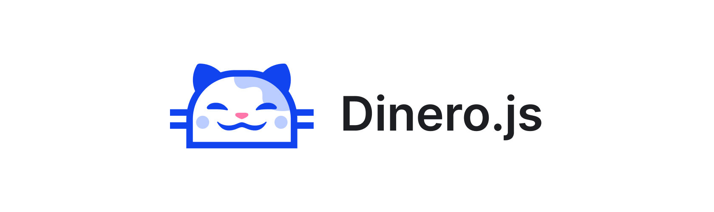

<p align="center">
  <a href="https://v2.dinerojs.com/docs">
    
  </a>
</p>

# Contributing to Dinero.js

You want to contribute to Dinero.js, and that's awesome 🎉👍 Thanks for that!

Before you dive in head first, there are a couple of guidelines to follow. Please make sure you read and understand them before you contribute. **Note that this isn't set in stone**. Polite debate and suggestions are welcome, as long as it's compliant with the [code of conduct](CODE_OF_CONDUCT.md), and it's done with the best interest of the library and the end-users in mind.

## ❓ Should I contribute?

Pushing your first contribution can be intimidating. A great way to start is by [fixing issues](https://github.com/dinerojs/dinero.js/issues). Find an open and confirmed issue, and open a pull request that fixes it.

✅ Please do:

- Fix [bugs](https://github.com/dinerojs/dinero.js/issues).
- Improve performance.
- Refactor with better design patterns.
- Improve the build process (speed, error handling, deprecations, etc.)
- Improve the docs (typos, lack of clarity, etc.)

🚫 Please don't:

- Go against the library's philosophy (immutability, modularity, etc.)
- Make changes based on personal preferences rather than problem-solving.
- Develop features that aren't in the scope of the library (if not sure, ask before you code).
- Introduce breaking changes.

## 💻 Install

The project relies on [Node.js](https://nodejs.org/) and [Yarn](https://yarnpkg.com/). It's also recommended to use [Node Version Manager](https://github.com/nvm-sh/nvm) to ensure you're using the right Node.js version.

To get started, clone the project and install the dependencies from your terminal:

```sh
git clone https://github.com/dinerojs/dinero.js.git
cd dinero.js
yarn install
nvm use
```

## 🖥️ Project organization

The project is organized as a monorepo under the `packages/` directory.

```txt
packages/
├── calculator-bigint/
├── calculator-number/
├── core/
├── currencies/
└── dinero.js/
```

## 📖 Conventions

The project observes a few rules and conventions when it comes to code. Most of them are automated, but make sure you understand them before submitting changes.

### Commit messages

The project follows the [conventional commits](https://www.conventionalcommits.org/) approach to standardize commit messages, generate the changelog and resolve the next version. It means that all commit messages should be formatted using the following scheme:

```txt
type(optional scope): subject
```

Available types are:

- `build`: changes affecting the build system or external dependencies
- `ci`: changes to CI configuration files and scripts
- `docs`: documentation changes
- `feat`: a new feature
- `fix`: a bug fix
- `perf`: changes improving performance
- `refactor`: changes that neither fixes a bug nor adds a feature
- `test`: adding or fixing tests
- `style`: a linting commit
- `revert`: a revert of a previous commit

### Pull requests

Pull requests must target `main`. As with commit messages, pull request titles must follow the [conventional commits](https://www.conventionalcommits.org/) convention.

### Branch organization

The project uses two sorts of long-lived branches:

- `main` as the default branch, where the latest version of the project lives
- `vx` (where `x` is a number, for example, `v1`) to version previous major versions

Pull requests should target the `main` branch unless fixing critical issues in previous major versions.

### Tests

The project uses [Jest](https://jestjs.io/) for testing. **Every public API should be tested**. You should run tests before you commit, or at least before you open a pull request. Pull requests need to pass all checks to be reviewed, so doing it beforehand will save you time.

```sh
yarn test
```

### Linting

The project uses [Prettier](https://prettier.io/) for code formatting and [ESLint](https://eslint.org/) for linting. Both run automatically when you commit, so you can go ahead and format as you like while writing code; it will be overridden anyway.

If ESLint finds issues it can't fix, you can fix it manually and try committing again.

## 📚 Documentation

The project lives in the `website/` directory. You can run it locally:

```sh
yarn website:dev
```

All documentation files live in `website/data/docs/`. They use [MDX](https://mdxjs.com/), which is a mix of [Markdown](https://daringfireball.net/projects/markdown/syntax) and [JSX](https://reactjs.org/docs/introducing-jsx.html).
